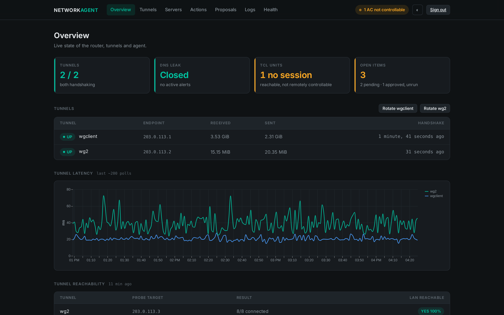
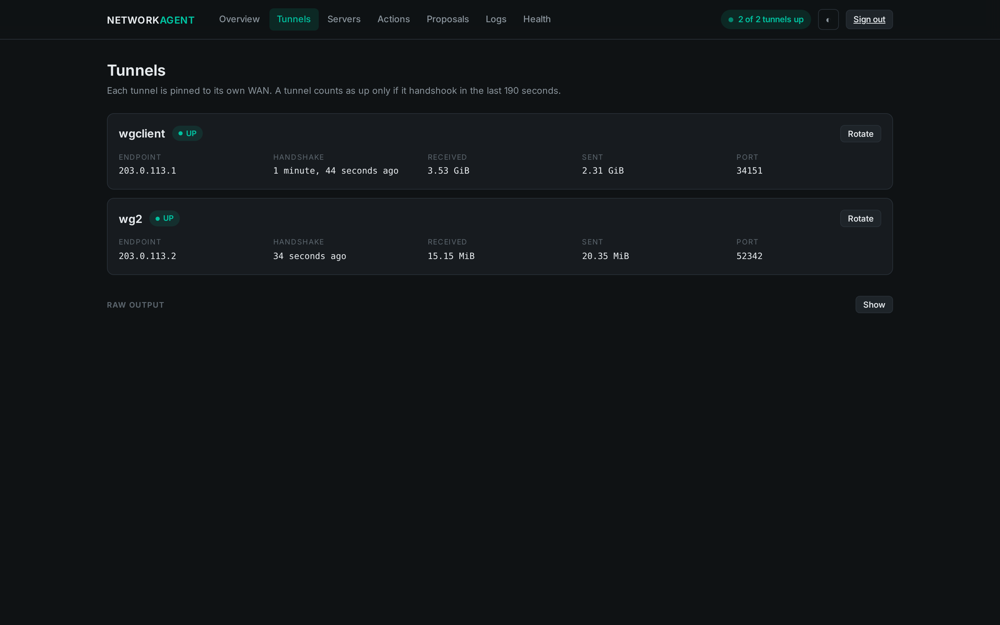
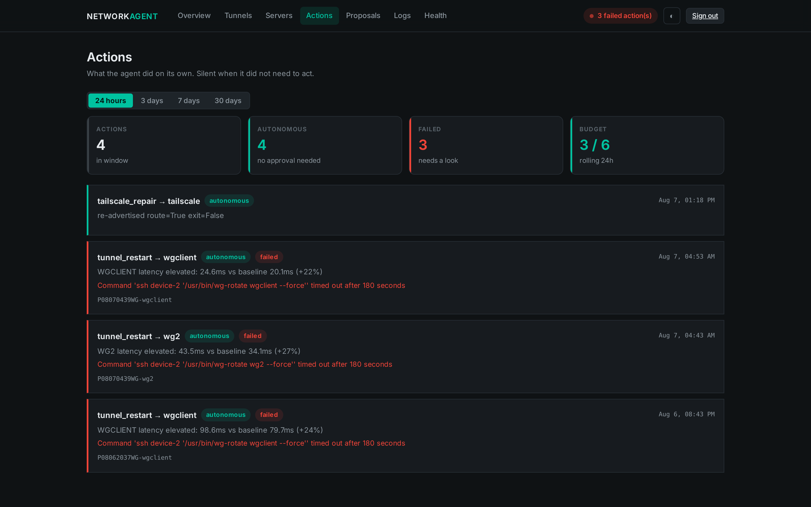
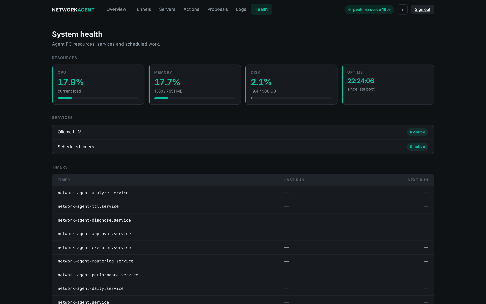

# network-agent

Self-hosted monitoring and remediation agent for a dual-WAN OpenWrt router
running two WireGuard tunnels. Detects tunnel degradation, DNS leaks, WAN
flaps and device outages, proposes remediation against a playbook, and can
execute a constrained set of actions autonomously under enforced guardrails.

## Screens

| | |
|---|---|
|  |  |
| **Overview** — colour is semantic: teal only when healthy, amber when something needs a human. | **Tunnels** — a tunnel counts as up only if it handshook within 190s. |
|  |  |
| **Actions** — what ran unattended, and how much of the daily autonomy budget it used. | **Health** — agent resources, services and timers. |

Full design notes, and the catalogue of failure modes this system was
built in response to, are in [ARCHITECTURE.md](ARCHITECTURE.md).

## Layout

| Path | Contents |
|---|---|
| `agent-pc/scripts/` | Collectors, analysis, diagnosis, execution |
| `dashboard/` | Flask dashboard - status, logs, proposals, actions |
| `systemd/` | Service and timer units |
| `router/remediation-20260805/` | Router-side fix scripts, each documenting the fault it repairs |

## Autonomy model

Actions are tiered. Level 1 runs unattended. One Level 2 action - WireGuard
peer rotation - runs autonomously under three independent ceilings: a
per-action cooldown, a daily cap that falls back to human approval rather
than going dark, and the router's own per-tunnel rotation cooldown.
Everything else requires explicit approval. A forbidden-actions list is
enforced fail-closed.

## Note on this repository

This is a filtered publication of a private repository. It contains source
only, with host-specific identifiers rewritten to documentation values -
usernames, LAN addresses, VPN endpoints and ISP names in both the source
and the screenshots. The substitution is consistent, so the code still
reads correctly; it is simply not this network. Operational logs, configuration, VPN server pools and router
configuration snapshots are deliberately excluded and are not recoverable
from this history. Published by `publish-public.sh`, which builds from an
allowlist and refuses to push if a secret scan matches.
